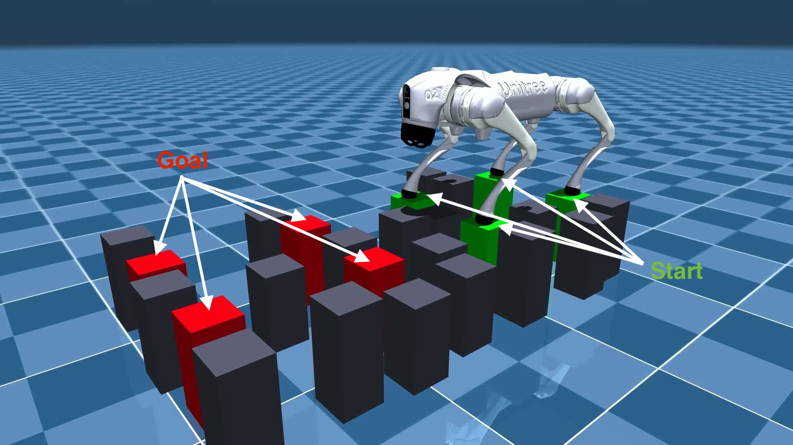

# Learning feasible transitions for efficient contact planning

[Webpage](https://rihat99.github.io/efficient_contact_planning/)

[Paper](https://arxiv.org/abs/2407.11788v2)

This repository is the code for the paper named "Learning feasible transitions for efficient contact planning". 



---

## Install

This project uses VS Code devcontainer. To run this workspace, please first install VS Code with the following extensions:
- Dev Containers (ms-vscode-remote.remote-containers)
- Remote Developement (ms-vscode-remote.vscode-remote-extensionpack)
- Docker (ms-azuretools.vscode-docker)

After that is done, clone this repository onto your developement PC.

```bash
git clone --recurse-submodules https://github.com/Atarilab/esfal.git
```

Then, enter the directory downloaded and open it in vscode

```bash
cd esfal && code .
```

After VS Code has started, there should be a prompt to start this workspace as a container.
Otherwise, you can also do *ctrl + shift + p* then select Dev Container: Rebuild and Reopen in Container to start it manually.

The environment is set up automatically with [BiConMP](https://github.com/machines-in-motion/biconvex_mpc) installed.


### Usage for planning on stepping stones

- [`main.py`](project/example/main.py) runs a minimal example with a stepping stones environment.

- [`run_mcts.py`](project/example/main.py) runs MCTS (with kinematic check only or learned dynamic feasibility) on a simple stepping stones environment.

### Usage to train models

- [`collect_data.py`](project/learning_jump_feasibility/collect_data.py) runs simulation and data collection process. Check the arguments. Data should be save in two train and test folders. One should be in project directory to run the script.
```python3
cd /home/atari_ws/project/

# Collect train data
python3 collect_data.py --saving_path /home/atari_ws/data/learning_jump_feasibility/train --N 10000 --cores 20 --gait jump

# Collect test data
python3 collect_data.py --saving_path /home/atari_ws/data/learning_jump_feasibility/test --N 1000 --cores 20 --gait jump
```

- [`main.py`](project/learning_jump_feasibility/main.py) run train the models on the data. Model are saved in learning_jump_feasibility/logs
```python3
cd /home/atari_ws/project/learning_jump_feasibility

# Train classifier
python3 main.py --train supervised --cfg ./config/classifierBinary.yml

# Train regressor
python3 main.py --train supervised --cfg ./config/regressorMLP.yml
```

### Run Experiments

 - [`run_experiments.py`](project/run_experiments.py) runs single experiment with specified parameters. To run experiments on various environments and algorithm changes, bash script is used.

 ```python3
 cd /home/atari_ws/project/

 # run single experiment
 python3 run_experiments.py --mode kin --num_remove 9 --pose_noise 0.75 --size_ratio 0.6 --id 0 --gait jump

 # run multiple experiments
 ./multiple_experiments.sh
 ```


